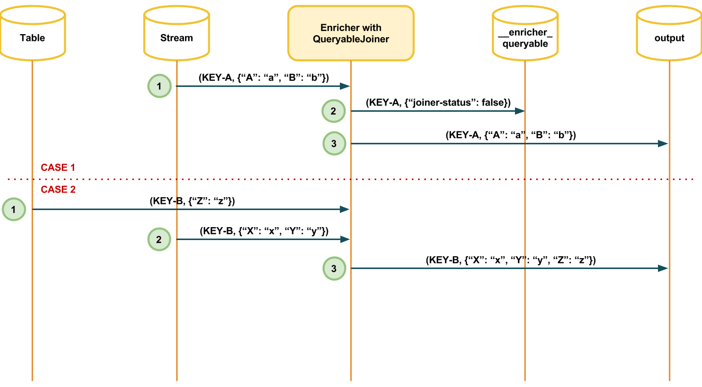

The queryable joiner works like base joiner. The difference is that a queryable joiner will notify to `__enricher_queryable` topic, if received message cannot be join it with other message with same key.



Image above represents the queryable joiner behaviour, we can see two cases:

* CASE 1: Received message cannot be joined with other with same key.

 1. Enricher receives a message from `stream` topic.
 2. As there is not any message from `table` topic, so enricher sends next notification to `__enricher_queryable`:
  ```
     (
       KEY-A,	
       {
         "joiner":"joinerStream",
         "type":"joiner-query",
         "table":"metrics",
         "joiner-status":false
       }
     )
  ```
 3. The Unjoined message is sends to `output` topic.
  
* CASE 2: Received message can be joined with other with same key.

 1. A message is received in `table` topic.
 2. Enricher receives a message from `stream` topic with same key that message received in `table` topic.
 3. Enricher joins the messages with same key and sends it to `output` topic:
 
Just the base joiner, queryable joiner have next functions:

|Function|Description|
|--------|-----------|
|StreamPreferredJoiner| Joiner that allows join both two streams of JSON objects, favoring the stream's fields.|
|TablePreferredJoiner| Joiner that allows join both two streams of JSON objects, favoring the tables's fields.|
